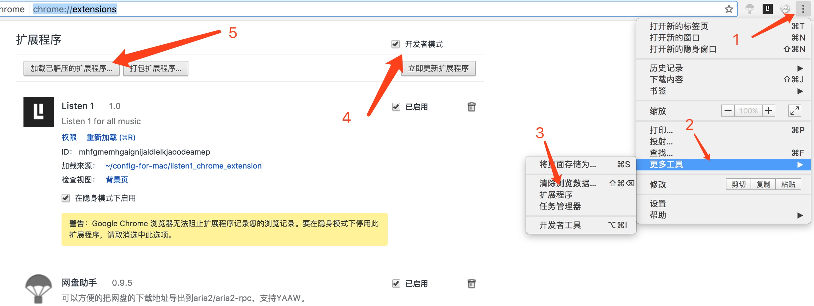
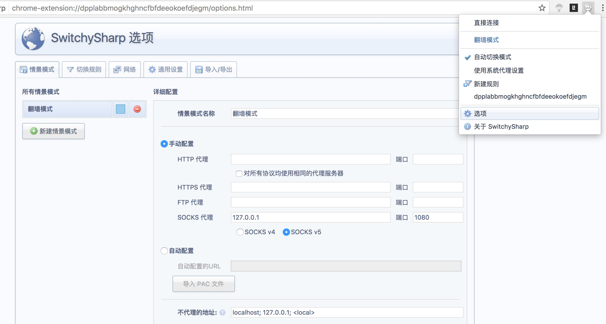
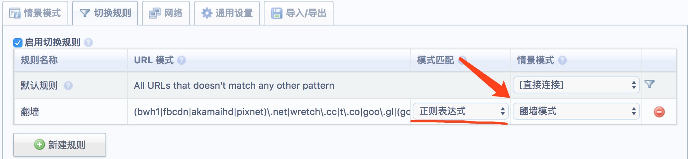

## config-for-mac

　　这是我个人使用电脑的一些配置脚本，个人的偏好设置，部分是高效开发使用，部分是个人喜好使用，在此记录方便以后自己查阅。

## ramDisk.sh

　　这是一个将内存虚拟化为硬盘的脚本，size = 1024M,名字为 ramdisk.主要用于存储 Xcode 编译生成的临时文件，加快重复编译时间。Xcode->Preferences->Locations->Derived Data 修改路径为虚拟化硬盘的路径。
  
## wifi.command

　　Mac 下查看 WiFi 密码特别不方便，而且我们一般连接上 WiFi 就不去记录 WiFi 密码，当朋友到家里玩的时候，通过各种方式查 WiFi 密码对于一个不懂计算机的人来说比较麻烦。本脚本后缀为.command，其目的是提供给非开发者使用。方便他们双击运行，看到 WiFi 名称和密码。

　　我用了这个 `wifi.command` ,感觉挺麻烦的，要输入 WiFi 名称、登录账户密码，搞得太麻烦了。现在开发了一个升级版本的在 WiFi-Password-Find 目录下，用的是 Python 脚本和 AppleScript 共同完成，Python 用于选择保存过的 WiFi 名称，AppleScript 用于完成登录框自动填充账户密码，点击确定。升级版本的脚本需要在 `AppleScript脚本` 中配置登录用户名和密码(修改`AppleScript脚本` 时，使用脚本编辑器或在VSCode一类的打开，别用文本编辑器打开，有中文会识别错误)

升级版本脚本使用：
- 修改 `AppleScript脚本` LoginUserName 为你电脑登录名。
- 修改 `AppleScript脚本` LoginUserPassword 为你电脑登录密码。
- 双击 `wifi.command` 执行，输入`数字`选择你保存过的 WiFi 名称即可。
- 双击 `currentWiFi.command` 执行，可查询当前正在连接的 WiFi。
- 如果只查询一次，用第一个版本也还不错。


## iTerm2配色方案

　　为了统一管理，将这些系统配置文件一律放到`~/config-for-mac`目录下。将 solarized 下载下来，拷贝到 `~/config-for-mac` 目录下。
　　打开 iterm　在 Preferences->Profiles->Colors 标签，点击 Load Preset 列表中的 Import 进行导入，然后选择一种即可。
```bash
$ git clone git://github.com/altercation/solarized.git
```

　　为了使终端的 ls 针对不同类型文件名称着色，我统一用 dircolors-solarized 配色，将 dircolors-solarized 下载到`~/config-for-mac`目录下。本次设置需要用 GNU Coreutils 替换 Mac 的 ls 命令。
```bash
# 安装 coreutils
$ brew install coreutils
# 下载 dircolors-solarized
$ cd ~/config-for-mac
$ git clone https://github.com/seebi/dircolors-solarized.git
# 配置 .bash_profile
$ vim ~/.bash_profile

##### 添加如下代码 #####
if brew list | grep coreutils > /dev/null ; then
  PATH="$(brew --prefix coreutils)/libexec/gnubin:$PATH"
  alias ls='ls -F --show-control-chars --color=auto'
  eval `gdircolors -b $HOME/config-for-mac/dircolors-solarized/dircolors.ansi-dark`
fi
#####     end    #####

# 使配置 .bash_profile 重新生效
$ source ~/.bash_profile
```
## Xcode 配置

```bash
$ cd ~/Desktop
# 下载Xcode配置文件
$ git cloen https://github.com/Hansoncoder/Solarized-Dark-for-Xcode.git
# 拷贝到 ~/Library/Developer/Xcode/UserData/FontAndColorThemes 目录
$ cd Solarized-Dark-for-Xcode
$ ./install.sh
# 偏好设置生效
打开Xcode -> Command+,(打开偏好设置) -> Fonts&Colors -> Solarized-Dark
```

## dotfile 配置

　　下载到`~/config-for-mac`目录下，执行命令一键配置。
```bash
$ cd ~/config-for-mac
$ git clone https://github.com/Hansoncoder/dotfiles.git
# 进入子目录执行bootstrap脚本
$ cd dotfiles && source bootstrap.sh
```

## Aria2 配置

```bash
$ cd ~/config-for-mac
# chrome网盘助手插件(不会的看文档)
$ https://github.com/acgotaku/BaiduExporter.git
# aria2GUI
$ https://github.com/yangshun1029/aria2gui/releases
```

## Ｌisten　1（关于音乐）

　　由于音乐版权问题，单个音乐播放器都会有一些歌曲无法播放，想听歌下载多个客户端，来回切换应用，真是麻烦的事。这个插件包含了网易云音乐、虾米、ＱＱ音乐的乐库，再也不用下载客户端那么麻烦了。

```bash
# 习惯将配置文件放这了
$ cd ~/config-for-mac
# 下载
$ git clone https://github.com/listen1/listen1_chrome_extension.git
打开Chrome -> Command+,(打开偏好设置) -> 扩展程序 -> 加载已解压的扩展程序(需要勾选 开发者模式)-> 选择刚刚下载的文件夹
```
新版本的Chrome操作如下


## 翻墙 SwitchySharp 自动切换

　　前提条件：已经装好 ShadowSocks 客户端，并且配置好翻墙，这里自己查看网上教程，很多地方都有，我用的是 [搬瓦工][1]，详细教程：[搬瓦工搭建Shadowsocks详细图文教程][2]

- 下载 SwitchySharp (Chrome 插件)
- 添加插件，打开插件-->选项-->情景模式-->socks代理【配置 本地代理】
```bash
情景模式名称：翻墙模式
socks代理：127.0.0.1  端口：1080
```


- 自动切换
　　打开插件-->选项-->切换规则-->新建规则【添加　正则表达式】
```bash
(fbcdn|akamaihd|pixnet)\.net|wretch\.cc|t\.co|goo\.gl|(google(usercontent|apis)*|chrome|staticflickr|imdb|ytimg|gstatic|html5rocks|amazonaws|github|tumblr|addthis|wordpress|blogger|(blog|app)spot|friendfeed|twitter|facebook|youtube|dropbox|feedburner|googleapis|android)\.com
```


> 
  + URL 模式：复制以上正则表达式到此
  + 模式匹配：正则表达式
  + 情景模式：刚刚添加的【翻墙模式】

- 正则表达式解析如下：

　　本解析目的是为增加其他匹配做铺垫，如果您需要翻墙浏览的网页没有被以下网址包含，可以自行添加。若不清楚正则表达式，请查看 [正则表达式 - 语法][3]

```bash
## ----
## 上面正则表达式解析如下
(fbcdn|akamaihd|pixnet)\.net # fbcdn.net
|wretch\.cc                  # wretch.cc
|t\.co                       # t.co
|goo\.gl                     # goo.gl
|(
    google(usercontent|apis)*
    |chrome
    |staticflickr
    |imdb
    |ytimg
    |gstatic
    |html5rocks
    |amazonaws
    |github              # 以 github.com 结尾
    |tumblr
    |addthis
    |wordpress
    |blogger
    |(blog|app)spot
    |friendfeed
    |twitter             # 以 twitter.com 结尾
    |facebook            # 以 facebook.com 结尾
    |youtube             # 以 youtube.com 结尾
    |dropbox
    |feedburner
    |googleapis
    |android
)\.com
```


## 参考文献

[[译]MAC OS X的命令行技巧](https://crazyof.me/blog/archives/2634.html)
[Awesome OS X Command Line](https://github.com/herrbischoff/awesome-osx-command-line)

[搬瓦工][1]
[搬瓦工搭建Shadowsocks详细图文教程][2]
[正则表达式 - 语法][3]

[1]:(https://bandwagonhost.com/aff.php?aff=7549)
[2]:(https://b.lhuac.com/post/2/)
[3]:(http://www.runoob.com/regexp/regexp-syntax.html)
